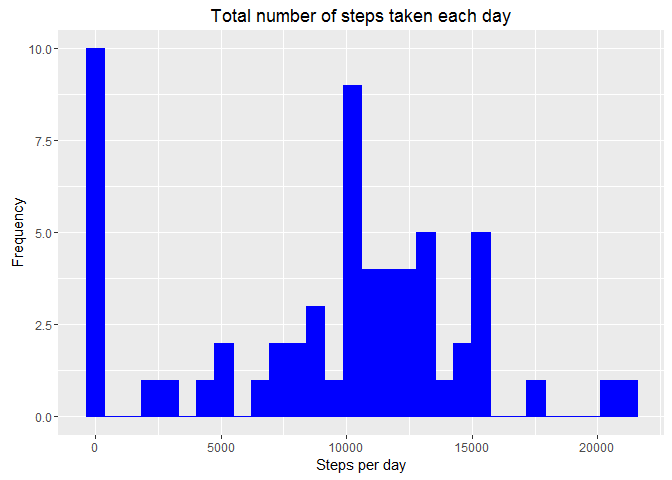
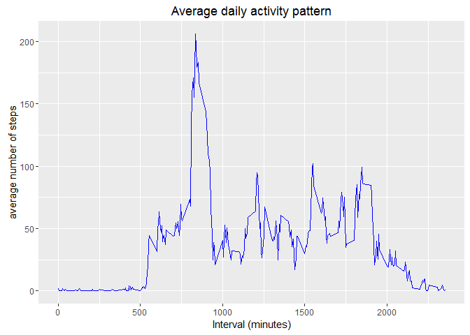
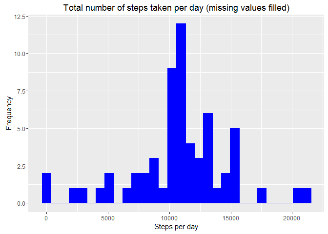
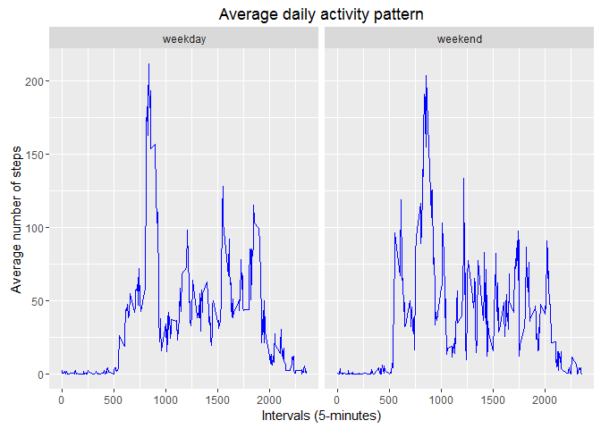
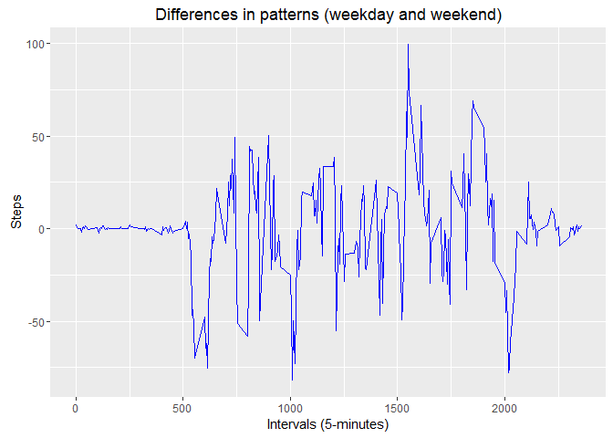

# Reproducible Research: Peer Assessment 1


## Loading and preprocessing the data
We are going to use the packages "dplyr" and "ggplot2":


```r
require(dplyr)
require(ggplot2)
require(reshape)
```

The very first step we must take is download the data and descompresed it:


```r
file <- "activity.csv"
if(!file.exists(file)){
     fileZip <- "activity.zip"
     if(!file.exists(fileZip)){
         temp <- tempfile()
          download.file("https://github.com/AMCampos/RepData_PeerAssessment1/blob/master/activity.zip", 
                        temp, mode="wb")
     }
     unzip(fileZip, file)
}
```

As we have a csv file, we'll use the "read.csv" function. I'm going to check if the object AMD already exists. If don't, I'll load it:


```r
if (!exists("AMD")){
     AMD <- read.csv(file,header = TRUE, sep=",", colClasses = c("numeric","Date","numeric"))     
}
```

We can check the AMD object:


```r
head(AMD)
```

```
##   steps       date interval
## 1    NA 2012-10-01        0
## 2    NA 2012-10-01        5
## 3    NA 2012-10-01       10
## 4    NA 2012-10-01       15
## 5    NA 2012-10-01       20
## 6    NA 2012-10-01       25
```

```r
tail(AMD)
```

```
##       steps       date interval
## 17563    NA 2012-11-30     2330
## 17564    NA 2012-11-30     2335
## 17565    NA 2012-11-30     2340
## 17566    NA 2012-11-30     2345
## 17567    NA 2012-11-30     2350
## 17568    NA 2012-11-30     2355
```

```r
str(AMD)
```

```
## 'data.frame':	17568 obs. of  3 variables:
##  $ steps   : num  NA NA NA NA NA NA NA NA NA NA ...
##  $ date    : Date, format: "2012-10-01" "2012-10-01" ...
##  $ interval: num  0 5 10 15 20 25 30 35 40 45 ...
```


## What is mean total number of steps taken per day?
To calculate the total number of steps taken per day, using "dplyr", we have to group by field "date" and sum the steps for each day (we store the sum in a new column: stepsDaily)


```r
AMDpd <- AMD %>% group_by(date) %>% summarise(stepsDaily=sum(steps, na.rm=TRUE))
```

And the histogram of the total number of steps per day:


```r
g1 <- ggplot(data=AMDpd, aes(x=stepsDaily)) 
g1 <- g1 + geom_histogram(na.rm = TRUE, col=I("blue"), fill=I("blue"))
g1 <- g1 + labs(title="Total number of steps taken each day")
g1 <- g1 + labs(x="Steps per day", y="Frequency")
g1
```

<!-- -->

Now, we are going to calculate the mean and median of the total number of steps taken per day:


```r
mean(AMDpd$stepsDaily, na.rm = TRUE)
```

```
## [1] 9354.23
```

```r
median(AMDpd$stepsDaily, na.rm = TRUE)
```

```
## [1] 10395
```

We could also calculate the mean and the median per day, for every interval:


```r
AMDpd2 <- AMD %>% group_by(date) %>% summarise(meanDay = mean(steps, na.rm=TRUE), medianDay = median(steps, na.rm=TRUE))

options(tibble.print_max=Inf)
AMDpd2
```

```
## # A tibble: 61 x 3
##          date    meanDay medianDay
##        <date>      <dbl>     <dbl>
## 1  2012-10-01        NaN        NA
## 2  2012-10-02  0.4375000         0
## 3  2012-10-03 39.4166667         0
## 4  2012-10-04 42.0694444         0
## 5  2012-10-05 46.1597222         0
## 6  2012-10-06 53.5416667         0
## 7  2012-10-07 38.2465278         0
## 8  2012-10-08        NaN        NA
## 9  2012-10-09 44.4826389         0
## 10 2012-10-10 34.3750000         0
## 11 2012-10-11 35.7777778         0
## 12 2012-10-12 60.3541667         0
## 13 2012-10-13 43.1458333         0
## 14 2012-10-14 52.4236111         0
## 15 2012-10-15 35.2048611         0
## 16 2012-10-16 52.3750000         0
## 17 2012-10-17 46.7083333         0
## 18 2012-10-18 34.9166667         0
## 19 2012-10-19 41.0729167         0
## 20 2012-10-20 36.0937500         0
## 21 2012-10-21 30.6284722         0
## 22 2012-10-22 46.7361111         0
## 23 2012-10-23 30.9652778         0
## 24 2012-10-24 29.0104167         0
## 25 2012-10-25  8.6527778         0
## 26 2012-10-26 23.5347222         0
## 27 2012-10-27 35.1354167         0
## 28 2012-10-28 39.7847222         0
## 29 2012-10-29 17.4236111         0
## 30 2012-10-30 34.0937500         0
## 31 2012-10-31 53.5208333         0
## 32 2012-11-01        NaN        NA
## 33 2012-11-02 36.8055556         0
## 34 2012-11-03 36.7048611         0
## 35 2012-11-04        NaN        NA
## 36 2012-11-05 36.2465278         0
## 37 2012-11-06 28.9375000         0
## 38 2012-11-07 44.7326389         0
## 39 2012-11-08 11.1770833         0
## 40 2012-11-09        NaN        NA
## 41 2012-11-10        NaN        NA
## 42 2012-11-11 43.7777778         0
## 43 2012-11-12 37.3784722         0
## 44 2012-11-13 25.4722222         0
## 45 2012-11-14        NaN        NA
## 46 2012-11-15  0.1423611         0
## 47 2012-11-16 18.8923611         0
## 48 2012-11-17 49.7881944         0
## 49 2012-11-18 52.4652778         0
## 50 2012-11-19 30.6979167         0
## 51 2012-11-20 15.5277778         0
## 52 2012-11-21 44.3993056         0
## 53 2012-11-22 70.9270833         0
## 54 2012-11-23 73.5902778         0
## 55 2012-11-24 50.2708333         0
## 56 2012-11-25 41.0902778         0
## 57 2012-11-26 38.7569444         0
## 58 2012-11-27 47.3819444         0
## 59 2012-11-28 35.3576389         0
## 60 2012-11-29 24.4687500         0
## 61 2012-11-30        NaN        NA
```


## What is the average daily activity pattern?
We make a time series plot of the five minute interval and the average number of steps taken, averaged across all days:


```r
AMDin <- AMD %>% group_by(interval) %>% summarise(meanSteps=mean(steps,na.rm=TRUE))
qplot(interval, meanSteps, data=AMDin, geom = "line", col=I("blue"), main="Average daily activity pattern", xlab="Interval (minutes)", ylab="average number of steps")
```

<!-- -->


We are going to use the function "which.max". This function return the index of the first maximum of a numeric or logical vector. So, with this information, we can get the interval:


```r
maxNumber <- AMDin[which.max(AMDin$meanSteps),]
```

So, the 5-minute interval that, on average, contains the maximum number of steps is 835, with a number of steps: 206.1698113.

## Imputing missing values
We can get the number of missing values with the "filter()" and "summarise()" functions:


```r
numNas <- AMD %>% filter(is.na(steps)==TRUE) %>% summarise(count=n())
numNas
```

```
##   count
## 1  2304
```

So, the number of missing values is 2304. To fill these missing values, we'll use this strategy: we are going to use the average value for every interval across all the days:


```r
AMD2 <- inner_join(AMD,AMDin)
```

```
## Joining, by = "interval"
```

```r
AMD2 <- AMD2 %>% mutate(steps=if_else(is.na(steps), meanSteps, steps))
```

Now, we have to drop the columns we don't need anymore, and we get a new dataset that is equal to the original dataset, but with the missing data fill in:


```r
AMD3 <- AMD2 %>% select(steps,date,interval)
head(AMD3)
```

```
##       steps       date interval
## 1 1.7169811 2012-10-01        0
## 2 0.3396226 2012-10-01        5
## 3 0.1320755 2012-10-01       10
## 4 0.1509434 2012-10-01       15
## 5 0.0754717 2012-10-01       20
## 6 2.0943396 2012-10-01       25
```


```r
AMD3pd <- AMD3 %>% group_by(date) %>% summarise(stepsDaily=sum(steps, na.rm=TRUE))

g2 <- ggplot(data=AMD3pd, aes(x=stepsDaily)) 
g2 <- g2 + geom_histogram(na.rm = TRUE, col=I("blue"), fill=I("blue"))
g2 <- g2 + labs(title="Total number of steps taken per day (missing values filled)")
g2 <- g2 + labs(x="Steps per day", y="Frequency")
g2
```

<!-- -->

The mean and median total number of steps taken per day, in this new dataset is:


```r
mean(AMD3pd$stepsDaily, na.rm = TRUE)
```

```
## [1] 10766.19
```

```r
median(AMD3pd$stepsDaily, na.rm = TRUE)
```

```
## [1] 10766.19
```

And, if we want to get the mean and the median per day, for every interval:


```r
AMD3pd <- AMD3 %>% group_by(date) %>% summarise(meanSteps=mean(steps,na.rm=TRUE), medianSteps=median(steps,na.rm=TRUE))
AMD3pd
```

```
## # A tibble: 61 x 3
##          date  meanSteps medianSteps
##        <date>      <dbl>       <dbl>
## 1  2012-10-01 37.3825996    34.11321
## 2  2012-10-02  0.4375000     0.00000
## 3  2012-10-03 39.4166667     0.00000
## 4  2012-10-04 42.0694444     0.00000
## 5  2012-10-05 46.1597222     0.00000
## 6  2012-10-06 53.5416667     0.00000
## 7  2012-10-07 38.2465278     0.00000
## 8  2012-10-08 37.3825996    34.11321
## 9  2012-10-09 44.4826389     0.00000
## 10 2012-10-10 34.3750000     0.00000
## 11 2012-10-11 35.7777778     0.00000
## 12 2012-10-12 60.3541667     0.00000
## 13 2012-10-13 43.1458333     0.00000
## 14 2012-10-14 52.4236111     0.00000
## 15 2012-10-15 35.2048611     0.00000
## 16 2012-10-16 52.3750000     0.00000
## 17 2012-10-17 46.7083333     0.00000
## 18 2012-10-18 34.9166667     0.00000
## 19 2012-10-19 41.0729167     0.00000
## 20 2012-10-20 36.0937500     0.00000
## 21 2012-10-21 30.6284722     0.00000
## 22 2012-10-22 46.7361111     0.00000
## 23 2012-10-23 30.9652778     0.00000
## 24 2012-10-24 29.0104167     0.00000
## 25 2012-10-25  8.6527778     0.00000
## 26 2012-10-26 23.5347222     0.00000
## 27 2012-10-27 35.1354167     0.00000
## 28 2012-10-28 39.7847222     0.00000
## 29 2012-10-29 17.4236111     0.00000
## 30 2012-10-30 34.0937500     0.00000
## 31 2012-10-31 53.5208333     0.00000
## 32 2012-11-01 37.3825996    34.11321
## 33 2012-11-02 36.8055556     0.00000
## 34 2012-11-03 36.7048611     0.00000
## 35 2012-11-04 37.3825996    34.11321
## 36 2012-11-05 36.2465278     0.00000
## 37 2012-11-06 28.9375000     0.00000
## 38 2012-11-07 44.7326389     0.00000
## 39 2012-11-08 11.1770833     0.00000
## 40 2012-11-09 37.3825996    34.11321
## 41 2012-11-10 37.3825996    34.11321
## 42 2012-11-11 43.7777778     0.00000
## 43 2012-11-12 37.3784722     0.00000
## 44 2012-11-13 25.4722222     0.00000
## 45 2012-11-14 37.3825996    34.11321
## 46 2012-11-15  0.1423611     0.00000
## 47 2012-11-16 18.8923611     0.00000
## 48 2012-11-17 49.7881944     0.00000
## 49 2012-11-18 52.4652778     0.00000
## 50 2012-11-19 30.6979167     0.00000
## 51 2012-11-20 15.5277778     0.00000
## 52 2012-11-21 44.3993056     0.00000
## 53 2012-11-22 70.9270833     0.00000
## 54 2012-11-23 73.5902778     0.00000
## 55 2012-11-24 50.2708333     0.00000
## 56 2012-11-25 41.0902778     0.00000
## 57 2012-11-26 38.7569444     0.00000
## 58 2012-11-27 47.3819444     0.00000
## 59 2012-11-28 35.3576389     0.00000
## 60 2012-11-29 24.4687500     0.00000
## 61 2012-11-30 37.3825996    34.11321
```

The impact on the estimates of the total daily number of steps is slight. The new values for mean and median for each day haven't changed too much. May be the greatest changes can be found on the median values: as we add a new values in place of NA values, (and this mean to update all the intervals in each date with NA because, as you can see in the next results, when you find a NA value, all the day has NA value). That is to say that the days with NA values have now the same values in all their intervals, so, the mean and the median are the same for this days.


```r
AMDna <- AMD %>% filter(is.na(steps)==TRUE)
AMDna %>% group_by(date) %>% summarise(count=n())
```

```
## # A tibble: 8 x 2
##         date count
##       <date> <int>
## 1 2012-10-01   288
## 2 2012-10-08   288
## 3 2012-11-01   288
## 4 2012-11-04   288
## 5 2012-11-09   288
## 6 2012-11-10   288
## 7 2012-11-14   288
## 8 2012-11-30   288
```


## Are there differences in activity patterns between weekdays and weekends?

We are going to use a function in order to get the day of the week in a numeric format. The "weekdays()" function return the name of the day (i.e. "sunday"), but ¿what happens if you are -like me- living in Spain, for instance?. It returns "domingo"... And I believe that the same happens if you are in France,... Our function uses an algorithm that has been pusblished in http://gaussianos.com/como-calcular-que-dia-de-la-semana-fue/, and returns a numeric value that say us the day of the week: 0 for monday, 1 for tuesday, etc... So, this is the function:


```r
dia <- function(x){
     # This algorithm has been published in http://gaussianos.com/como-calcular-que-dia-de-la-semana-fue/
     # To stay simple, we assume the date is between 2000 and 2099
     a <- 0
     b <- as.numeric(substr(as.character(format(x,'%Y')),3,5))
     b <- b + trunc(b/4)
     c <- 0
     
     m=as.numeric(format(x,"%m"))
     
     if (a%%4==0 & ((m==1||m==2))){
          c <- -1
     }
     
     d <- as.numeric(substr("622503514624", m, m))
     e <- as.numeric(format(x,"%d"))
     t <- a + b + c + d + e
     t%%7
}
```

Now, we can get a new dataset with a column that contains the type of day:


```r
AMD3 <- AMD3 %>% mutate(typeofday = if_else(dia(date) %in% seq(1:5),"weekday","weekend"))
AMD3 <- AMD3 %>% mutate(typeofday = as.factor(typeofday))
```

Plot with the average number of steps taken (averaged across all weekday days or weekend days):


```r
AMD3in <- AMD3 %>% group_by(interval,typeofday) %>% summarise(meanSteps=mean(steps,na.rm=TRUE))
gr <- ggplot(AMD3in, aes(x=interval, y=meanSteps)) + geom_line(colour="blue")
gr <- gr + ggtitle("Average daily activity pattern")
gr <- gr + labs(x="Intervals (5-minutes)", y="Average number of steps")
gr <- gr + facet_grid(.~typeofday) 
gr
```

<!-- -->

I would like to say that it would be nice to add some other plots (means difference between intervals in weekday and weekend) to show the differents patters between a "week day" and a "weekend day":


```r
ex1 <- cast(AMD3in,interval ~ typeofday, value="meanSteps")
ex1 <- ex1 %>% mutate(dif=weekday-weekend)
p <- ggplot(ex1, aes(x=interval,y=dif)) + geom_line(colour="blue")
p <- p + labs(title="Differences in patterns (weekday and weekend)", x="Intervals (5-minutes)", y="Steps")
p
```

<!-- -->

In this plot, the possitive values for dif tell us that there are more steps in a week day than in a weekend day for a given interval. Negatives values for dif involve more steps in a weekend day than in a week day, for a given interval. By the way, we can see a negative values between 500 and 600 (five to six), maybe because the subject get up earlier on weekend. Also there is more activity in weekdays about 1500 (going job?) or 1900 (coming bak home?). 
 
. 

